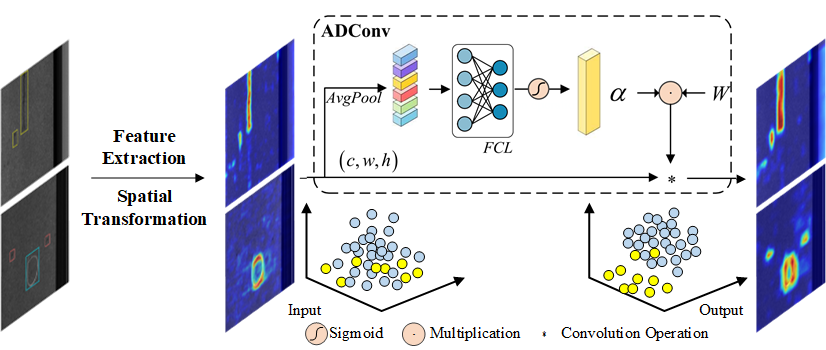

# FDADNet: Detection of Surface Defects in Wood-Based Panels Based on Frequency Domain Transformation and Adaptive Dynamic Downsampling
⭐ This code has been completely released ⭐ 

⭐ our [article](https://www.mdpi.com/2227-9717/12/10/2134) ⭐ 


If our code is helpful to you, please cite:

```
@article{li2024fdadnet,
  title={FDADNet: Detection of Surface Defects in Wood-Based Panels Based on Frequency Domain Transformation and Adaptive Dynamic Downsampling},
  author={Li, Hongli and Yi, Zhiqi and Wang, Zhibin and Wang, Ying and Ge, Liang and Cao, Wei and Mei, Liye and Yang, Wei and Sun, Qin},
  journal={Processes},
  volume={12},
  number={10},
  pages={2134},
  year={2024},
  publisher={Multidisciplinary Digital Publishing Institute}
}
```


## Requirements

```python
pip install -r requirements.txt
```

<p align="center">  </p>


[//]: # (## Train)
## Train

### 1. Prepare training data 

- The download link for the WBP-DET data set is [here](https://pan.baidu.com/s/1l4sG494P7kDh_mf_leDoLw?pwd=LySk).
- The download link for the NEU-DET data set is [here](http://faculty.neu.edu.cn/songkechen/zh_CN/zdylm/263270/list/).
- The download link for the GC10-DET data set is [here](https://github.com/lvxiaoming2019/GC10-DET-Metallic-Surface-Defect-Datasets).
- The download link for the APDDD data set is [here](https://tianchi.aliyun.com/dataset/148297).

```python
FDADNet
├── WBP-DET
│   ├── images
│   │   ├── 1.jpg
│   │   ├── 2.jpg
│   │   ├── .....
│   ├── labels
│   │   ├── 1.txt
│   │   ├── 2.txt
│   │   ├── .....
```

### 2. Begin to train
```python
python train.py
```

## Test

### 1. Weight

- The download link for the weight is [here](https://pan.baidu.com/s/1tIQfSV4AxbB4KFrpp-dIOQ?pwd=LySk).
### 2. Begin to test
```python
python val.py
```

## Results

|   **Methods**    |  **OS**  |  **GS**  |  **Sc**  |  **Ch**  |  **OD**  | **mAP50** | **Params/M** $\downarrow$ | **GFLOPs** $\downarrow$ |
|:----------------:|:--------:|:--------:|:--------:|:--------:|:--------:|:---------:|:-------------------------:|:-----------------------:|
| **Faster R-CNN** |   64.9   |   65.7   |   65.5   |    96    |   75.8   |   73.6    |           41.37           |           134           |
|   **YoloV5s**    |   57.3   |   56.1   |   62.2   |    98    |   68.3   |   68.4    |           7.02            |          15.8           |
|  **YoloX-Tiny**  | **67.9** |   65.8   |   45.8   |   93.9   |   60.5   |   66.8    |           5.03            |          7.57           |
|    **RTMDet**    |   52.9   |   69.9   | **86.1** |   97.6   | **82.2** |   77.8    |           4.87            |          8.02           |
| **YoloV7-Tiny**  |   61.2   |   74.6   |   40.5   |   97.2   |   70.1   |   68.7    |           6.01            |          13.1           |
|   **YoloV8n**    |   57.9   |   61.9   |   59.9   |   97.4   |    79    |   71.2    |           3.01            |           8.1           |
|   **YoloV10n**   |   51.1   |   64.8   |   63.1   |   97.3   |   68.9   |   69.1    |          **2.7**          |           8.2           |
|    **RTDETR**    |    56    |   56.7   |   77.9   |   91.8   |   74.6   |   71.4    |           31.9            |          103.5          |
|   **FDADNet**    |   61.3   | **79.3** |   85.5   | **98.4** |   73.7   | **79.6**  |            4.5            |         **6.2**         |

- Bold indicates first or second best performance.


## Time
2024.8.3 Upload code

2024.8.3 Upload requirements.txt

2024.8.6 Upload Dataset

<p align="center">  </p>
<p align="center">  </p>

2024.10.14 Upload readme

## Visualization of results
<p align="center">  </p>

## Acknowledgements
This code is built on [ultralytics (PyTorch)](https://github.com/ultralytics/ultralytics). We thank the authors for sharing the codes.

In the comparative experiment, Faster RCNN, YOLOX, and RTMDet networks were replicated using [mmdetection](https://github.com/open-mmlab/mmdetection).We thank the authors for sharing the codes.

## Contact
If you have any questions, please contact me by email (lazyshark2001@gmail.com).
